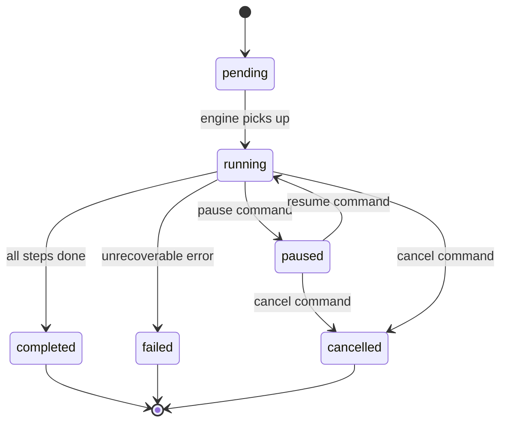
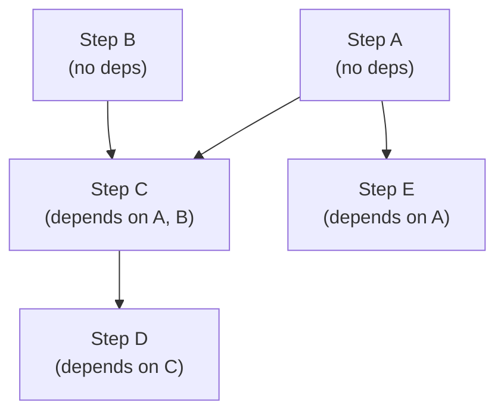
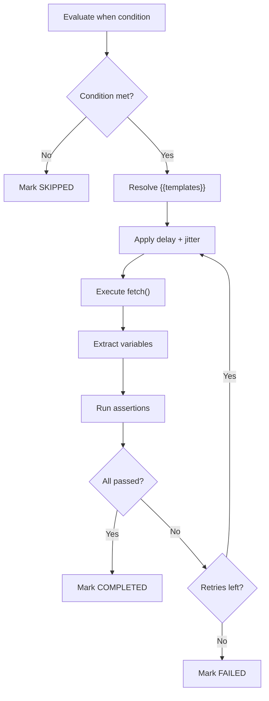

# Scenario Engine

The scenario engine (`apps/demo-dashboard/src/server/engine.ts`) is the core execution runtime. It takes a scenario definition from the catalog, resolves its dependency graph, and executes each step — making HTTP requests, evaluating assertions, and extracting variables for downstream steps.

---

## Execution Model

### Modes

| Mode | Trigger | Real-time | Report |
|------|---------|-----------|--------|
| **Simulation** | `POST /api/simulations` or WebSocket `SCENARIO_START` | Yes (WebSocket streaming) | No |
| **Assessment** | `POST /api/assessments` | Yes (WebSocket streaming) | Yes (score, pass/fail) |

Both modes use the same execution loop. The difference is that assessments generate a final report with a pass/fail verdict.

### State Machine



Terminal states (`completed`, `failed`, `cancelled`) can be **restarted**, which creates a new execution with a `parentExecutionId` reference.

---

## DAG Scheduling

Steps are not executed linearly. The engine builds a directed acyclic graph from `dependsOn` declarations and executes steps in waves.



**Execution order for the graph above:**
1. **Wave 1**: A and B execute in parallel (no dependencies)
2. **Wave 2**: C and E execute in parallel (A is done; C waits for both A and B)
3. **Wave 3**: D executes (C is done)

### Algorithm

```
pending = all step IDs
completed = empty set

while pending is not empty:
    check for pause/cancel

    executable = steps where:
        - all dependsOn IDs are in completed set
        - when condition evaluates to true (or absent)

    if executable is empty and pending is not empty:
        → deadlock detected (circular dependency)

    execute all executable steps in parallel (Promise.all)
    move completed steps from pending to completed
```

### Deadlock Protection

The validator (`@crucible/catalog`) catches cycles at load time using Kahn's algorithm. The engine also detects deadlocks at runtime — if no steps are executable but some remain pending, execution fails with an error.

---

## Step Execution

Each step goes through this sequence:



### Template Resolution

Before each request, the engine replaces `{{variable}}` placeholders in the URL, headers, and body:

| Variable | Source | Example Value |
|----------|--------|--------------|
| `{{random}}` | Built-in | `a7f3b2c1` |
| `{{random_ip}}` | Built-in | `192.168.42.17` |
| `{{timestamp}}` | Built-in | `1708700000000` |
| `{{iteration}}` | Built-in (loop counter) | `3` |
| `{{token}}` | Extracted from prior step | `eyJhbGci...` |

### Variable Extraction

After a successful request, `extract` rules capture values from the response:

```json
"extract": {
  "auth_token": { "from": "body", "path": "data.access_token" },
  "request_id": { "from": "header", "path": "X-Request-Id" },
  "status_code": { "from": "status" }
}
```

| `from` | Behavior |
|--------|----------|
| `body` | Parse JSON response, traverse dot-path (e.g., `data.access_token`) |
| `header` | Read response header by name |
| `status` | Capture the HTTP status code |

Extracted values are stored in a shared context `Map<string, unknown>` available to all subsequent steps.

### Assertions

Each assertion is evaluated independently. A step passes only when **all** assertions succeed.

| Assertion | Check |
|-----------|-------|
| `status: 200` | HTTP response status === 200 |
| `blocked: true` | Status is 403 or 429 |
| `bodyContains: "success"` | Response body includes the string |
| `bodyNotContains: "error"` | Response body does NOT include the string |
| `headerPresent: "X-Request-Id"` | Response has this header |
| `headerEquals: {"Content-Type": "application/json"}` | Header value matches exactly |

Assertion results are recorded per-step:

```json
{
  "field": "status",
  "expected": 200,
  "actual": 403,
  "passed": false
}
```

### Conditional Execution

The `when` clause controls whether a step should run based on a prior step's outcome:

```json
"when": {
  "step": "login",
  "succeeded": true
}
```

| Condition | Evaluates to true when... |
|-----------|--------------------------|
| `succeeded: true` | Referenced step status is `completed` |
| `succeeded: false` | Referenced step status is `failed` |
| `status: 403` | Referenced step's status assertion actual value is 403 |

If the condition is false, the step is **skipped** (not failed).

### Retries and Iterations

- **Retries**: On assertion failure, the engine retries the step up to `execution.retries` times. Each retry includes the configured delay and jitter.
- **Iterations**: The step executes `execution.iterations` times in sequence. The last response is used for assertions and extraction.
- **Delay**: Fixed pause in milliseconds before each attempt.
- **Jitter**: Random additional delay between 0 and the jitter value, added to the base delay.

---

## Concurrency Control

The engine limits concurrent executions with a semaphore:

- **Default max**: 3 (configurable via `CRUCIBLE_MAX_CONCURRENCY`)
- New executions queue when all slots are occupied
- Slots are released when an execution reaches a terminal state

This prevents resource exhaustion when multiple users or automated systems trigger simultaneous executions.

---

## Assessment Scoring

When an execution completes in `assessment` mode, the engine generates a report:

```
score = (passed steps / total steps) * 100
passed = score >= 80
```

| Steps | Passed | Score | Verdict |
|-------|--------|-------|---------|
| 10 | 10 | 100% | PASS |
| 10 | 8 | 80% | PASS |
| 10 | 7 | 70% | FAIL |
| 10 | 0 | 0% | FAIL |

Skipped steps are counted toward the total but not as passed.

---

## Memory Management

The engine cleans up terminal executions to prevent unbounded memory growth:

| Rule | Threshold |
|------|-----------|
| **TTL** | Evict terminal executions older than 30 minutes |
| **Max count** | If > 50 executions stored, evict oldest terminal ones first |
| **Cleanup interval** | Runs every 60 seconds |

Active (running/paused) executions are never evicted.

---

## Event System

The engine emits events at each state transition. The WebSocket layer listens to these events and broadcasts them to all connected clients.

| Engine Event | WebSocket Event | When |
|-------------|-----------------|------|
| `execution:started` | `EXECUTION_STARTED` | Execution begins |
| `execution:updated` | `EXECUTION_UPDATED` | A step completes (pass or fail) |
| `execution:completed` | `EXECUTION_COMPLETED` | All steps done |
| `execution:failed` | `EXECUTION_FAILED` | Unrecoverable error |
| `execution:paused` | `EXECUTION_PAUSED` | Pause acknowledged |
| `execution:resumed` | `EXECUTION_RESUMED` | Resume acknowledged |
| `execution:cancelled` | `EXECUTION_CANCELLED` | Cancel acknowledged |

Each event payload contains the full `ScenarioExecution` object, so clients always have a complete snapshot of the current state.
