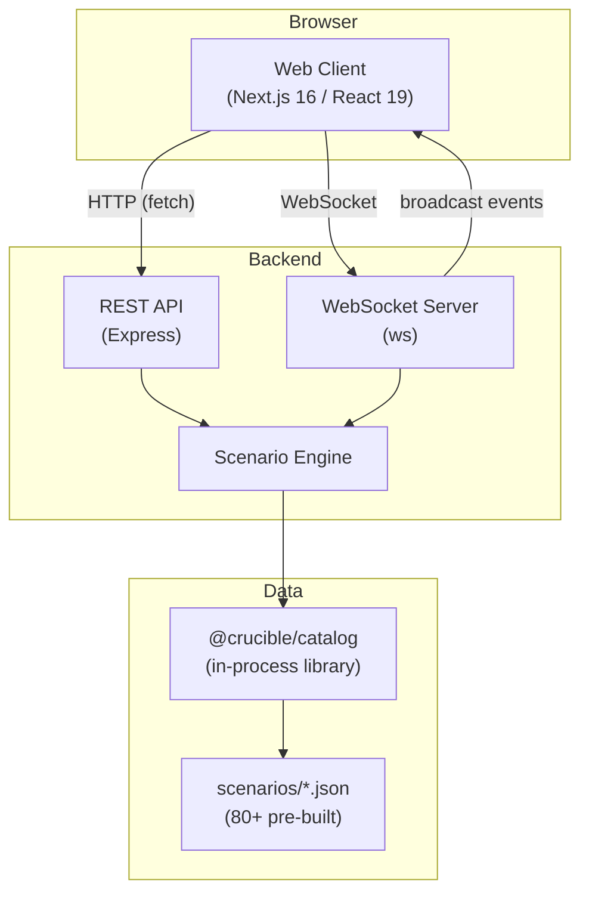
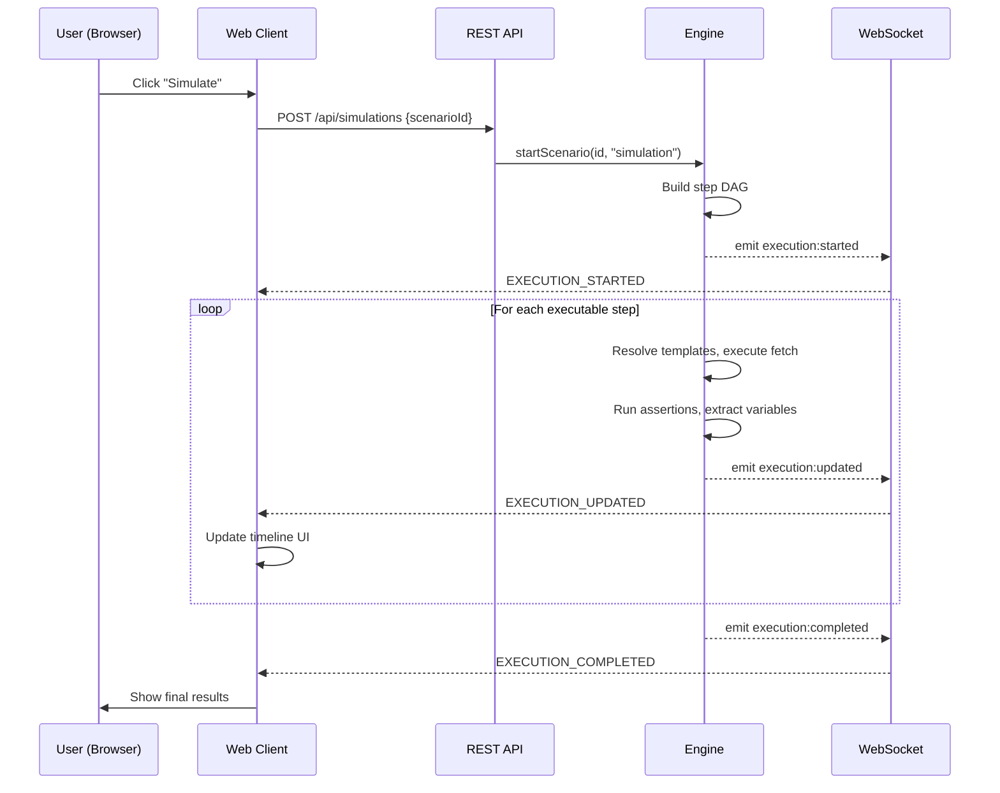

# System Overview

Crucible is a monorepo containing three packages that work together to provide a security scenario testing platform.

---

## Component Map



### Package Roles

| Package | Type | Responsibility |
|---------|------|---------------|
| `@crucible/catalog` | Library | Type definitions (Zod schemas), scenario JSON loading, structural validation, runbook parsing |
| `web-client` | Application | User interface — scenario browsing, editing, simulation monitoring, assessment review |
| `demo-dashboard` | Application | Execution backend — REST API, WebSocket event broadcasting, scenario engine |

### Key Dependency Chain

```
web-client ──imports──► @crucible/catalog (types only, at build time)
demo-dashboard ──imports──► @crucible/catalog (types + CatalogService at runtime)
```

The catalog is a **build-time** dependency for the web client (it uses the TypeScript types) and a **runtime** dependency for the demo-dashboard (it loads and serves scenarios from disk).

---

## Data Flow

### Scenario Lifecycle

```mermaid
flowchart LR
    A["JSON files<br/>packages/catalog/scenarios/"] --> B["CatalogService<br/>parse + validate"]
    B --> C["In-memory Map"]
    C --> D["REST API<br/>GET /api/scenarios"]
    D --> E["Web Client<br/>scenario cards"]
    E --> F["User clicks<br/>Simulate / Assess"]
    F --> G["POST /api/simulations<br/>or /api/assessments"]
    G --> H["Scenario Engine<br/>DAG execution"]
    H --> I["WebSocket broadcast<br/>EXECUTION_UPDATED"]
    I --> J["Web Client<br/>live timeline"]
```



### Startup Sequence

1. **Backend starts** — `CatalogService` reads all `*.json` files from `packages/catalog/scenarios/`, validates each with Zod schemas and structural checks, loads valid scenarios into an in-memory `Map<id, Scenario>`
2. **Express server binds** to port 3001 with REST routes and WebSocket upgrade handler
3. **Web client starts** — connects to `ws://localhost:3001` and fetches `GET /api/scenarios` to populate the UI

### Execution Flow



---

## Communication Protocols

### REST API (Express on port 3001)

| Method | Route | Purpose |
|--------|-------|---------|
| GET | `/api/scenarios` | List all loaded scenarios |
| PUT | `/api/scenarios/:id` | Update a scenario (validates + writes to disk) |
| POST | `/api/simulations` | Start a real-time simulation |
| POST | `/api/assessments` | Start a pass/fail assessment |
| GET | `/api/reports/:id` | Fetch assessment report (202 if in-progress) |
| POST | `/api/executions/:id/pause` | Pause an execution |
| POST | `/api/executions/:id/resume` | Resume a paused execution |
| POST | `/api/executions/:id/cancel` | Cancel an execution |
| POST | `/api/executions/:id/restart` | Restart a completed/failed execution |
| POST | `/api/executions/pause-all` | Pause all running executions |
| POST | `/api/executions/resume-all` | Resume all paused executions |
| POST | `/api/executions/cancel-all` | Cancel all active executions |
| GET | `/health` | Health check with scenario count |

### WebSocket Protocol

The WebSocket connection uses a simple JSON message format.

**Client to server** (commands):

```json
{
  "type": "SCENARIO_START",
  "payload": { "scenarioId": "auth-bypass" },
  "timestamp": 1708700000000
}
```

Command types: `SCENARIO_START`, `SCENARIO_PAUSE`, `SCENARIO_RESUME`, `SCENARIO_STOP`, `SCENARIO_RESTART`, `GET_STATUS`, `PAUSE_ALL`, `RESUME_ALL`, `CANCEL_ALL`

**Server to all clients** (broadcast events):

```json
{
  "type": "EXECUTION_UPDATED",
  "payload": { "id": "abc123", "steps": [...], "status": "running" },
  "timestamp": 1708700001000
}
```

Event types: `EXECUTION_STARTED`, `EXECUTION_UPDATED`, `EXECUTION_COMPLETED`, `EXECUTION_FAILED`, `EXECUTION_PAUSED`, `EXECUTION_RESUMED`, `EXECUTION_CANCELLED`

---

## State Management

### Backend

The engine maintains execution state in memory:
- Active executions: `Map<id, ScenarioExecution>`
- Concurrency semaphore: max 3 concurrent (configurable)
- Cleanup: terminal executions evicted after 30 minutes or when count exceeds 50

### Frontend

A single Zustand store (`useCatalogStore`) manages all client state:

```
scenarios[]          ← fetched from GET /api/scenarios
executions[]         ← updated via WebSocket events
activeExecution      ← currently selected execution
wsConnected          ← WebSocket connection status
isLoading / error    ← request state
```

WebSocket messages flow through the `useWebSocket` hook (initialized once in the site header) and call `updateExecution()` on the store, which triggers React re-renders across the simulations and assessments pages.

---

## Technology Stack

| Layer | Technology |
|-------|-----------|
| UI Framework | Next.js 16 (App Router, React 19) |
| Styling | Tailwind CSS 4, Radix UI, shadcn/ui |
| State | Zustand |
| Backend | Express 4, ws (WebSocket) |
| Validation | Zod |
| Build | Nx (monorepo orchestration), pnpm workspaces |
| Testing | Vitest |
| CI/CD | GitHub Actions |
| Container | Docker (multi-stage, standalone Next.js) |
| Registry | GitHub Container Registry (GHCR) |
